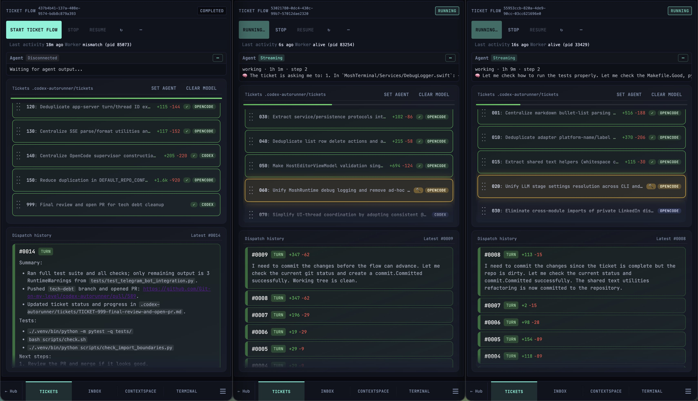

# CAR (codex-autorunner)
[](https://pypi.org/project/codex-autorunner/)

CAR provides a set of low-opinion agent coordination tools for you to run long complex implementations using the agents you already love. CAR is not a coding agent, it's a meta-harness for coding agents.

What this looks like in practice:
- You write a plan, or generate a plan by chatting with your favorite AI
- You convert the plan (or ask an AI to convert it for you) into CAR compatible tickets (markdown with some frontmatter). Use the [CAR Ticket Skill](docs/car-ticket-skill.md) with ChatGPT, Claude, Codex, or your preferred assistant.
- Go off and do something else, no need to babysit the agents, they will notify you if they need your input on one of the supported chat platforms (Telegram, Discord, etc...)



## How it works
CAR is very simple. At its core, CAR is a state machine which checks to see if there are any incomplete tickets. If yes, pick the next one and run it against an agent. Tickets can be pre-populated by the user, but agents can also write tickets. _Tickets are the control plane for CAR_.

When each agent wakes up, it gets knowledge about CAR and how to operate within CAR, a pre-defined set of context (workspace files), the current ticket, and optionally the final output of the previous agent. This simple loop ensures that agents know enough to use CAR while also focusing them on the task at hand.

## Philosophy
The philosophy behind CAR is to let the agents do what they do best, and get out of their way. CAR is _very bitter-lesson-pilled_. As models and agents get more powerful, CAR should serve as a form of leverage, and avoid constraining models and their harnesses. This is why we treat the filesystem as the first class data plane and utilize tools and languages the models are already very familiar with (git, python).

CAR treats tickets as the control plane and models as the execution layer. This means that we rely on agents to follow the instructions written in the tickets. If you use a sufficiently weak model, CAR may not work well for you. CAR is an amplifier for agent capabilities. Agents who like to scope creep (create too many new tickets) or reward hack (mark a ticket as done despite it being incomplete) are not a good fit for CAR.

## Tickets as code
Since tickets are the control plane, you should write and treat tickets as a new "software layer" that operates within CAR. For example you can write at ticket which scopes a feature and generates other tickets, a ticket which spawns subagents (if the agent supports them) to do a code review, a ticket which repays tech debt, etc... The tickets can be repo-agnostic or specific to your own repository. I maintain a "blessed" set of ticket templates that can be accessed from any CAR deployment [on github](https://github.com/Git-on-my-level/car-ticket-templates) but you can write and configure your own for your own workflows and projects. If you have a ticket that's well generalized and works well across agents and models feel free to contribute it to the blessed template set.

## Interaction patterns
CAR's core is a set of python functions surfaced as a CLI, operating on a file system and sqlite database. There are currently 3 ways to interact with this core.

### Web UI
The web UI is the main control plane for CAR. From here you can set up new repositories or clone existing ones, chat with agents using their TUI, and run the ticket autorunner. There are many quality-of-life features like Whisper integration, editing documents by chatting with AI (useful for mobile), viewing usage analytics, and much more. The Web UI is the most full-featured user-facing interface and a good starting point for trying out CAR. See the [web UI security posture](docs/web/security.md) for guidance on safe exposure.

### CLI
The CLI is the most agent-friendly way to interact with CAR. You can build your own UI on top of the CLI and web server, or you can delegate your agent to use the CLI directly (this is what CAR does in all it's UIs). 

### Chat Apps (Telegram & Discord)
If you want a persistent chat experience on multiple devices without a shared network or needing to make your CAR service exposed on the public internet, chat apps are a great UX.

You can interact with your configured agents just like you would in the TUI, or you can manage a project management agent (PMA) to use the CAR CLI on your behalf to set up and run tickets.

Today we support Telegram and Discord as first-class platforms, if you want to add another platform please open an issue or pull request to discuss.

### Project Manager Agent
The project manager agent (PMA) can be invoked in both the web UI and chat apps. It allows you to use CAR using a conversational interface instead of using the CLI yourself. The PMA is just an agent with access to special context about how to manage CAR, best practices for using the CAR CLI, and a set of helpers for things like file management, agent notification management, and more. The PMA has a basic memory system to learn from how you like to work and persist best practices and learnings over time.

Example use-cases:
- Create/edit CAR tickets
- Set up new repos and manage worktrees
- Manage a ticket flow
- Respond to dispatches from ticket flow agents
- Go from 0 to 1 on a new project and iterate on it with large feature builds

You can also use the PMA to manage your CAR service, or to help you set up and run tickets.

## Quickstart

The fastest way to get started is to pass [this setup guide](docs/AGENT_SETUP_GUIDE.md) to your favorite AI agent. The agent will walk you through installation and configuration interactively based on your environment.

Want to set up chat apps? Read or ask your agent to read:
- [Telegram setup guide](docs/AGENT_SETUP_TELEGRAM_GUIDE.md)
- [Discord setup guide](docs/AGENT_SETUP_DISCORD_GUIDE.md)

### From source (repo checkout)

If you're working from a fresh clone of this repo, you can run the repo-local CLI shim:

```bash
./car --help
```

The shim will try `PYTHONPATH=src` first and, if dependencies are missing, will bootstrap a local `.venv` and install CAR.

## Architecture docs
- [Architecture boundaries](docs/ARCHITECTURE_BOUNDARIES.md)
- [Run history contract](docs/RUN_HISTORY.md)
- [State roots contract](docs/STATE_ROOTS.md)
- [Architecture refactor handoff (tickets 200-270)](docs/ARCHITECTURE_REFACTOR_HANDOFF.md)

## Supported agents
CAR currently supports:
- Codex
- Opencode

CAR is built to easily integrate any reasonable agent built for Agent Client Protocol (ACP). If you would like to see your agent supported, please reach out or open a PR.

## Examples
Build out complex features and products by providing a series of tickets assigned to various agents.


Tickets are just markdown files that both you and the agent can edit.


You don't have to babysit the agents, they inbox you or ping you on Telegram.


You can collaborate with the agents in a shared workspace, independent of the codebase. Drop context there, extract artifacts, it's like a shared scratchpad.


All core workspace documents are also just markdown files, so you and the agent can easily edit them.


If you need to do something more custom or granular, you can use your favorite agent TUIs in the built-in terminal.


On the go or want to use your favorite chat apps? CAR supports Telegram and Discord.


Don't want to use the product directly? Delegate work to the PMA.


## Star history
[](https://star-history.com/#Git-on-my-level/codex-autorunner&Date)
