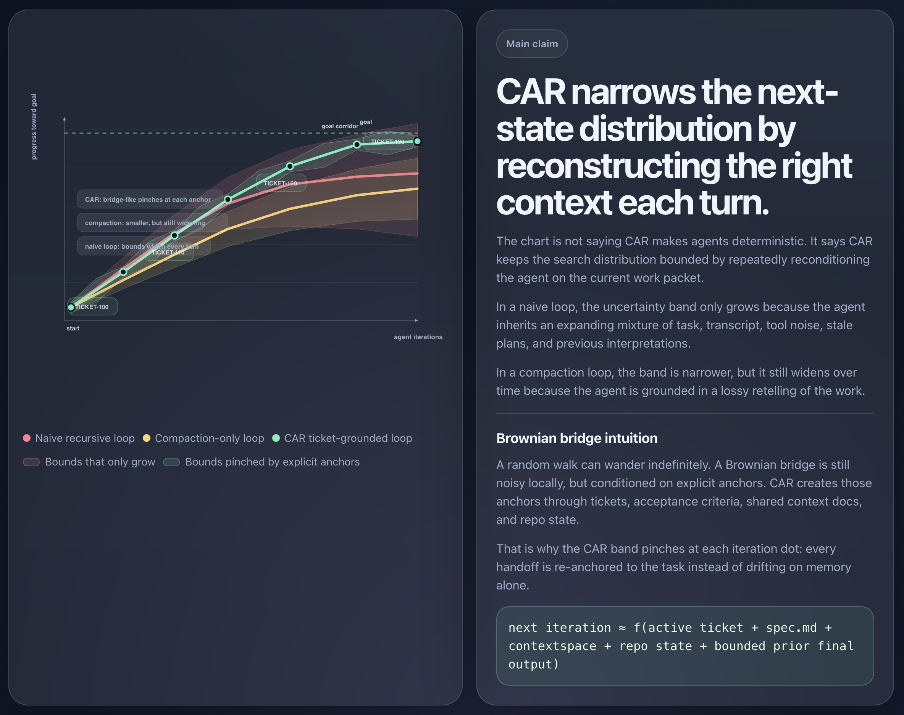

# CAR (codex-autorunner)
[](https://pypi.org/project/codex-autorunner/)

**One durable attention router for every agent you run.**

CAR v3 ingests lifecycle and attention events from coding agents, CI, cron, and other
automation; groups them into one trustworthy inbox; routes human replies back to the
right source; and records every decision and delivery. Autonomous operators, policy
judgment, and learning are replaceable capability providers rather than CAR core.

**What you actually do with CAR:**
- Connect the agents and automation you already use.
- Choose the native provider, Hermes, or a scoped combination for operator, policy,
  and memory capabilities.
- Handle one attention inbox, grant or revoke autonomy, and inspect why CAR routed or
  executed each effect.

---

## 🚧 CAR v3 — the attention router

CAR is pivoting: v3 is a cross-vendor attention router that ingests
lifecycle/attention events from *any* agent (Claude Code, Codex, Hermes, OMP, agentctl,
Multica, CI, cron), preserves human handoffs, and routes replies and authorized effects
through one audited core — one inbox for "what needs me," not a per-tool ticket queue.
**Status: alpha, actively under construction, lives entirely under [`v3/`](./v3/).**
Start here: [`v3/README.md`](./v3/README.md) (quickstart) and [`v3/DESIGN.md`](./v3/DESIGN.md)
(binding spec). The accepted router/provider boundary is
[`ADR 0001`](./v3/docs/architecture/0001-attention-router-capability-providers.md).

CAR v2, the runner/ticket product documented below, is **deprecated immediately**. It
remains runnable during migration and receives only security fixes, critical correctness
fixes, and migration support. It is not a co-equal product direction.

---

## ⚠️ Deprecated CAR v2 documentation

Everything below this point describes the deprecated Python runner/ticket product. It
is retained temporarily for existing installations while the v3 installation and
migration path is completed.

### Legacy quickstart

### Option 1 — Let your agent install it (recommended)

Paste this to Codex, Cursor, Hermes, OpenCode, or whichever assistant you trust on your machine:

> Please walk me through setting up CAR (codex-autorunner) using this guide:
> https://github.com/Git-on-my-level/codex-autorunner/blob/main/docs/AGENT_SETUP_GUIDE.md

The agent will check prerequisites, install CAR, initialize a hub, and configure your first repo interactively.

### Option 2 — Install it yourself

```bash
pipx install codex-autorunner   # or: pip install codex-autorunner
car --version
mkdir ~/car-hub && cd ~/car-hub
car init --mode hub
```

Then open the web UI and add a repo. Full walkthrough: [AGENT_SETUP_GUIDE.md](docs/AGENT_SETUP_GUIDE.md).

### Legacy v2 add-ons

- 💬 [Telegram setup](docs/AGENT_SETUP_TELEGRAM_GUIDE.md) · [Discord setup](docs/AGENT_SETUP_DISCORD_GUIDE.md) - Pick one
- 🤖 [Hermes setup](docs/ops/hermes-acp.md) - Legacy v2 PMA setup; its global-memory
  recommendation is not the v3 default topology
- 🤖 [OMP setup](docs/ops/omp-acp.md) - ACP-backed, native durable sessions under `~/.omp/agent`
- 🐳 [Docker runtime per repo/worktree](docs/configuration/destinations.md) - For running agents in a containerized environment

---

## 🧠 How it works



At its core, CAR is a state machine: while there are incomplete tickets, pick the next one and run it against an agent. Tickets can be pre-written by you, by agents, or on the fly.

> _Tickets are the control plane. Agents are the execution layer._

When an agent wakes up it gets: knowledge of CAR, a pre-defined `contextspace`, the current ticket, and optionally the previous agent's output. That's it.

📸 [See it in action — full screenshot gallery](docs/screenshots/GALLERY.md)

---

## 🎛️ Ways to interact

| Surface | When to use it |
|---|---|
| **Web UI** | Main control plane. Set up repos, chat with agents, run the autorunner, view usage. Start here. ([security notes](docs/web/security.md)) |
| **CLI** | The agent-friendly surface. Not really made for human use. |
| **Telegram / Discord** | Persistent multi-device chat without exposing your hub to the internet. |
| **Project Manager Agent (PMA)** | Legacy v2 conversational interface to CAR itself. Hermes can supply the PMA through the v2 setup; v3 makes continuity an explicit user choice. |

---

## 🤖 Supported agents

- **Codex**
- **Hermes**
- **OMP** (Oh My Pi)
- **OpenCode**

CAR integrates any reasonable [ACP](https://github.com/zed-industries/agent-client-protocol) agent. Want yours added? Open an issue or PR.

---

## 🧭 Philosophy

CAR is _very bitter-lesson-pilled_. As models and agents get stronger, CAR should serve as leverage and stay out of their way. We treat the filesystem as the first-class data plane and lean on tools agents already know cold (git, python, markdown).

Because tickets are the control plane and agents are the execution layer, **CAR is an amplifier**. With a strong model it sings; with a model that scope-creeps or reward-hacks (marks tickets done that aren't), it will not.

### Tickets as code

Tickets aren't just task descriptions — they're a software layer that operates inside CAR. You can write tickets that scope a feature and generate child tickets, spawn subagent code reviews, repay tech debt, etc. Tickets can be repo-agnostic or project-specific.

I maintain a ["blessed" set of templates](https://github.com/Git-on-my-level/car-ticket-templates) accessible from any CAR deployment. Got a generalizable ticket that works well across agents? Contribute it.

---

## 📚 Learn more

- 🗺️ [Interactive architecture explorer (Principal Forks)](https://app.principal-ade.com/Principal-Forks/codex-autorunner)
- 📜 [Codebase constitution](docs/car_constitution/10_CODEBASE_CONSTITUTION.md)
- 🏛️ [Architecture map](docs/car_constitution/20_ARCHITECTURE_MAP.md)
- 📐 [Engineering standards](docs/car_constitution/30_ENGINEERING_STANDARDS.md)
- 📝 [Run history contract](docs/RUN_HISTORY.md) · [State roots contract](docs/STATE_ROOTS.md)

### From source

```bash
./car --help
```

The shim tries `PYTHONPATH=src` first and bootstraps a local `.venv` if dependencies are missing.

---

## ⭐ Star history

[](https://star-history.com/#Git-on-my-level/codex-autorunner&Date)
