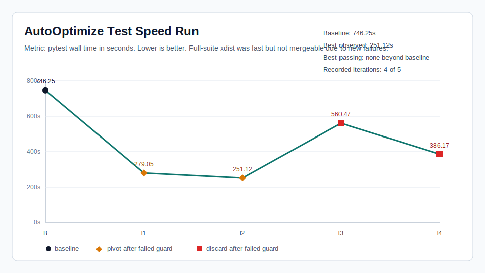

# AutoOptimize Test Speed Run - 2026-04-29

This report captures the stopped AutoOptimize run from branch
`autooptimize-test-speed-5`.

Run id: `77586ac2-e5a8-4b04-804f-ca0dfb07a0f2`

AutoOptimize app run id: `autooptimize-146b5e7b24bb`

## Result

The run found large theoretical speedups from pytest-xdist, but no full-suite
configuration was mergeable because each full-suite xdist variant introduced
failures beyond the existing baseline failures. The safe change in this PR is
to apply parallel execution only to the fast local make target:

```bash
make test-fast
```

The optimized target passed locally with `8105 passed in 111.74s`.

## Chart



## Iteration Stats

| Step | Hypothesis | Time | Delta vs baseline | Guard | Decision |
| --- | --- | ---: | ---: | --- | --- |
| Baseline | Serial `pytest -q -m "not integration"` | 746.25s | 0.0% | 23 pre-existing failures | baseline |
| Iteration 1 | Global xdist `-n auto` | 279.05s | 62.6% faster | fail, about 10 new failures | pivot |
| Iteration 2 | Global xdist with `--dist loadfile` | 251.12s | 66.4% faster | fail, about 7 new failures | pivot |
| Iteration 3 | Limited global xdist `-n 2` | 560.47s | 24.9% faster | fail, about 6 new failures | discard |
| Iteration 4 | `-n 3 --dist loadfile` plus serialized non-unit grouping | 386.17s | 48.3% faster | fail, about 3 new failures | discard |

## What Was Kept

The mergeable conclusion is narrower than the fastest experiment:

- Keep xdist out of global `pyproject.toml` defaults for now.
- Use xdist with a conservative four-worker default for the fast,
  non-integration, non-slow local target.
- Keep the worker count configurable through `PYTEST_FAST_WORKERS` for
  `make test-fast` and `CODEX_FAST_TEST_WORKERS` for `scripts/check.sh`.
- Preserve serial behavior for the broader `test-full` and integration targets.

## Validation

- `make test-fast`: passed, `8105 passed in 111.74s`.
- A 10-worker `-n auto` run passed once in 63.06s but was rejected after a
  later local timeout in
  `tests/integrations/chat/test_hermes_official_completion.py::test_telegram_pma_turn_completes_for_official_hermes_prompt[asyncio]`.
- A more aggressive `--dist loadfile` fast-target variant was rejected after a
  local timeout in
  `tests/integrations/discord/test_dispatch_validation.py::test_dispatch_deferred_slash_commands_ack_before_prior_handler_finishes[asyncio]`.
- Serial comparison command, `/usr/bin/time -p .venv/bin/python -m pytest -m
  "not integration and not slow"`, timed out one test after `8094` passes and
  `188.51s` wall time. That reinforced the decision to keep only the passing
  parallel fast target in this PR.

## Why The Run Took So Long

The eight-hour runtime came from the campaign design and the agent's measurement
strategy, not from one single hung process.

- The baseline ticket ran multiple full-suite measurements before recording
  state. The recorded baseline alone took 746.25 seconds.
- Each iteration repeatedly ran expensive full-suite pytest commands to compare
  xdist modes and diagnose the new failures they introduced.
- Full-suite xdist attempts did not fail fast. They typically had to run most of
  the suite before exposing the final failure count.
- The agent reran variants such as `-n auto`, `--dist loadfile`, `-n 2`, `-n 3`,
  and grouping experiments instead of using a fixed per-iteration time budget.
- Flow status looked stale during long pytest tool calls because CAR did not
  surface child process activity as flow freshness.
- AutoOptimize created extra follow-up tickets even though the five-iteration
  queue had already been pre-created, adding queue noise.

Follow-up tracking:

- Flow status child activity: https://github.com/Git-on-my-level/codex-autorunner/issues/1660
- App metadata in flow status: https://github.com/Git-on-my-level/codex-autorunner/issues/1657
- Blessed/third-party app distribution: https://github.com/Git-on-my-level/codex-autorunner/issues/1658
