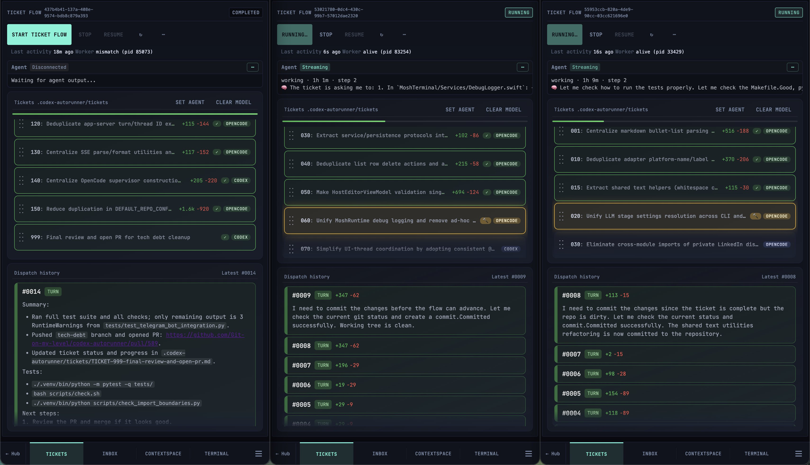
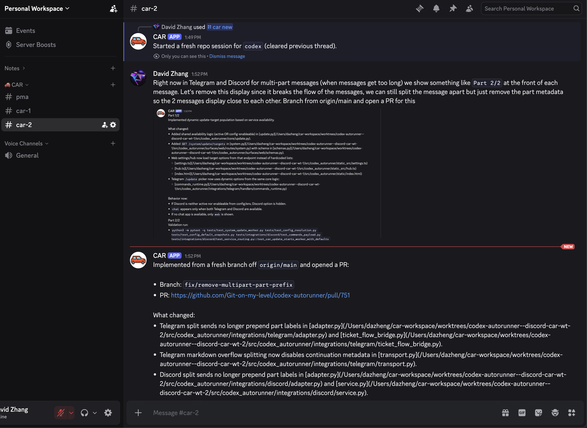
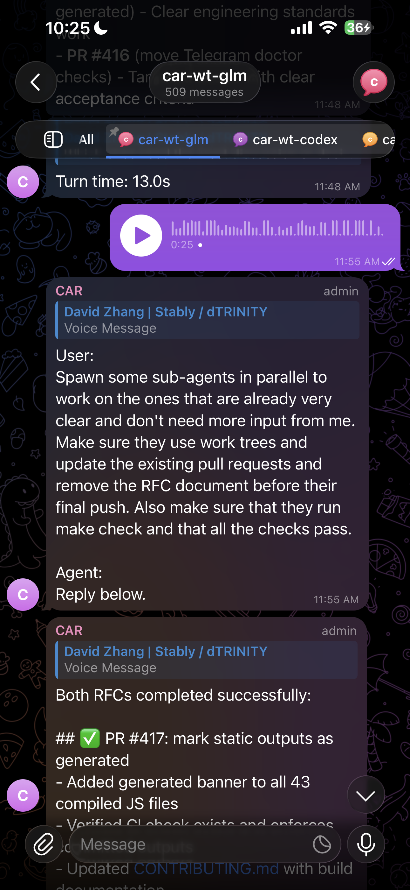
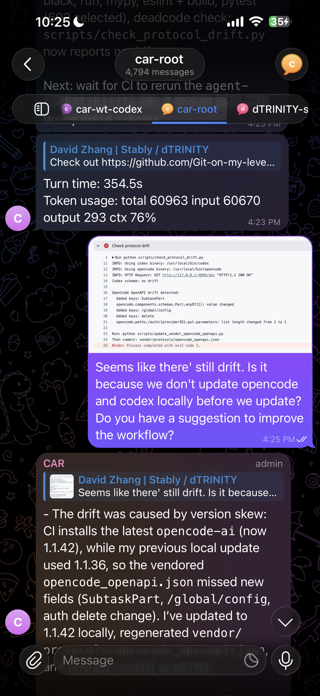
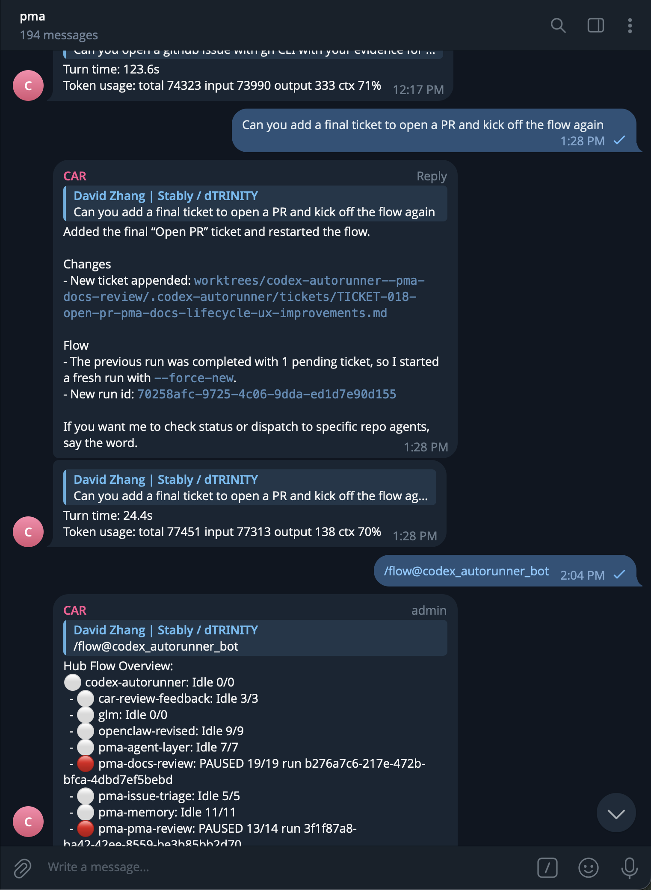

# CAR Screenshot Gallery

A visual tour of CAR in action.

## Hub & tickets

Manage many repos and ticket flows from one place.

Build complex features by chaining tickets across agents.

Tickets are just markdown — you and the agents both edit them.

## Notifications & contextspace

Agents inbox you when they need input — no babysitting.

Collaborate with agents in a shared `contextspace/` scratchpad, independent of the codebase.

## Built-in terminals

Drop into your favorite agent TUI when you need fine-grained control.

## Chat apps

Telegram and Discord are first-class — work from anywhere without exposing your hub to the public internet.

Or delegate everything to the Project Manager Agent (PMA) over chat.

