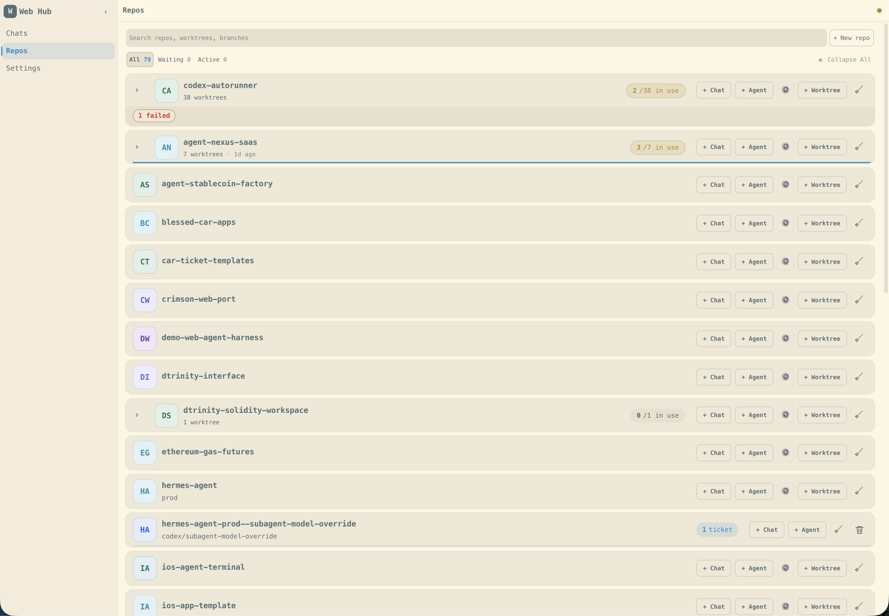
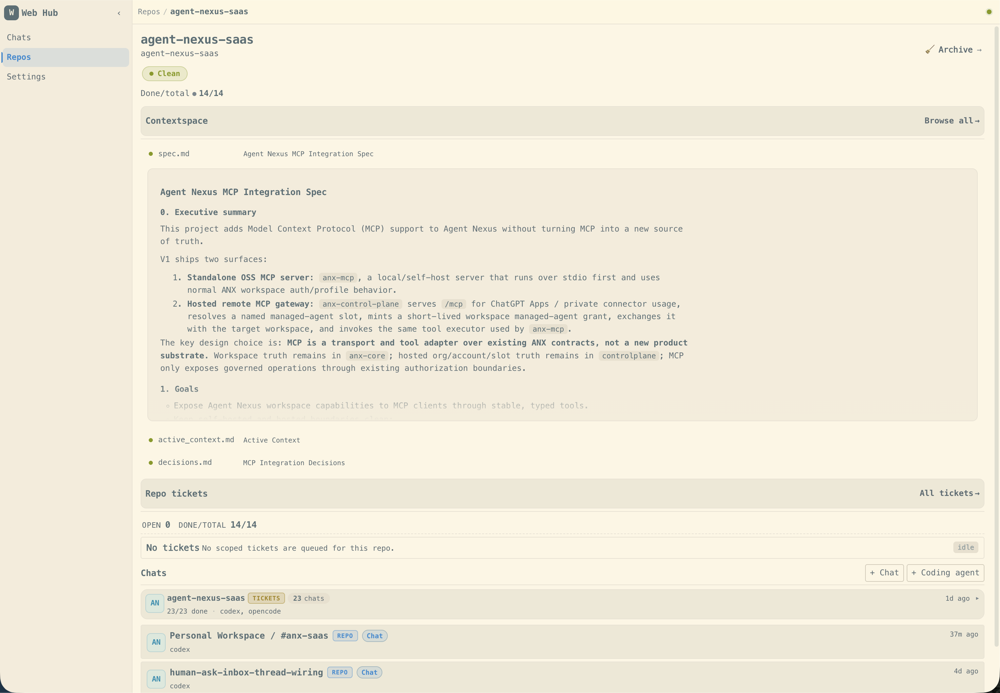
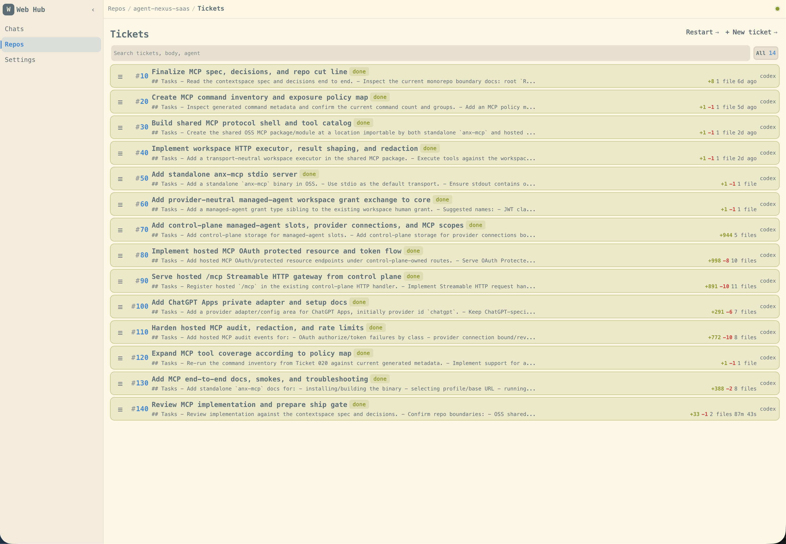
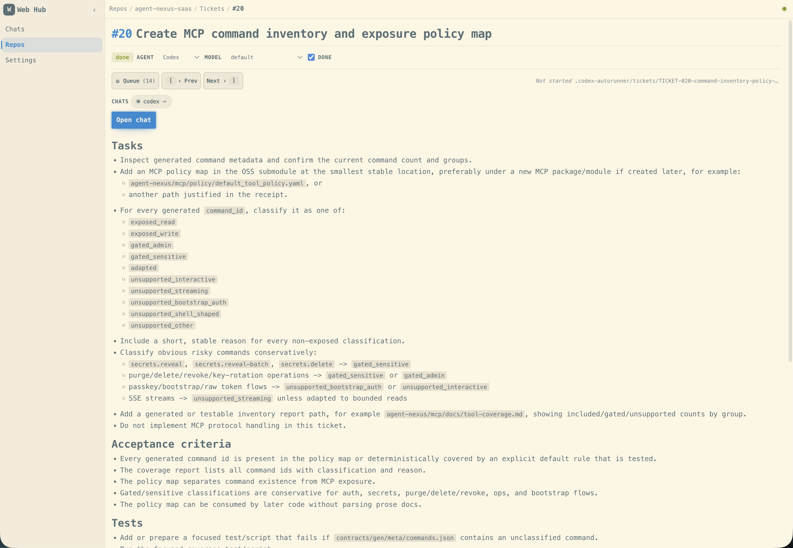
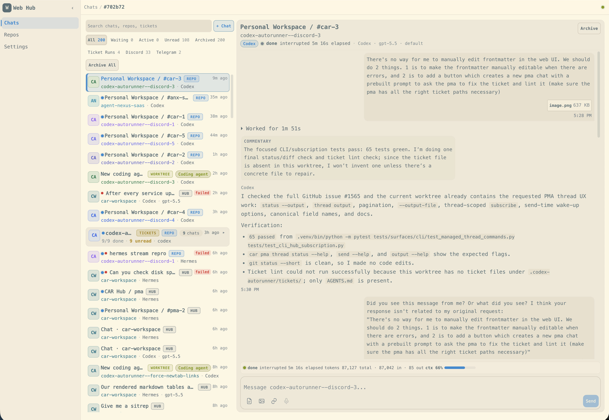
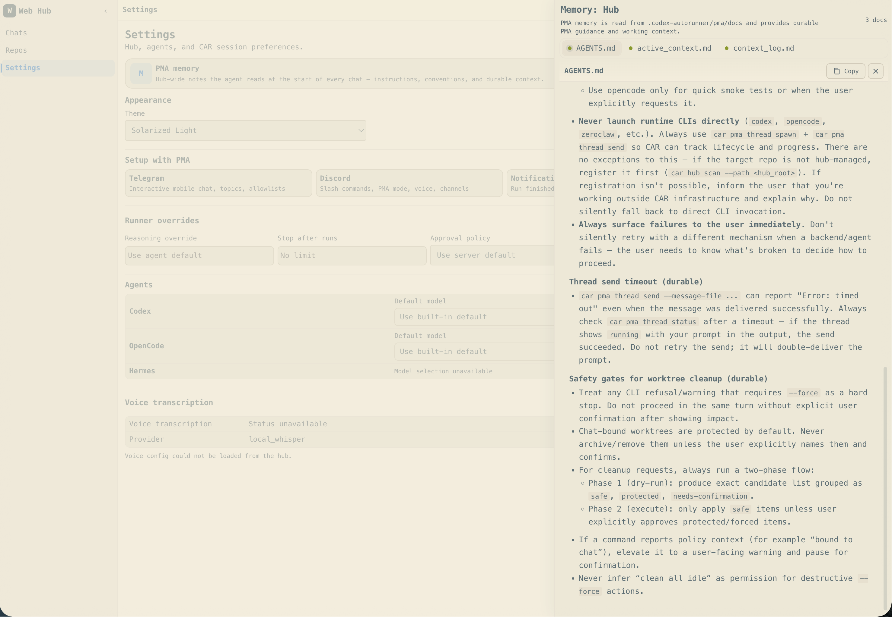

# CAR Screenshot Gallery

A visual tour of CAR in action.

## Repos & tickets

Browse every connected repository from the Web Hub home.

Open a repo for worktrees, sync, and repo-scoped tickets.

Work the global queue or open a single ticket — still markdown for you and your agents.

## Hub chat & PMA

Use the in-browser hub for long threads and agent runs when you want the full UI.

Inspect and adjust what the Project Manager Agent (PMA) keeps in working memory.

## Chat apps

Telegram and Discord are first-class — work from anywhere without exposing your hub to the public internet.

Or delegate everything to the Project Manager Agent (PMA) over chat.

